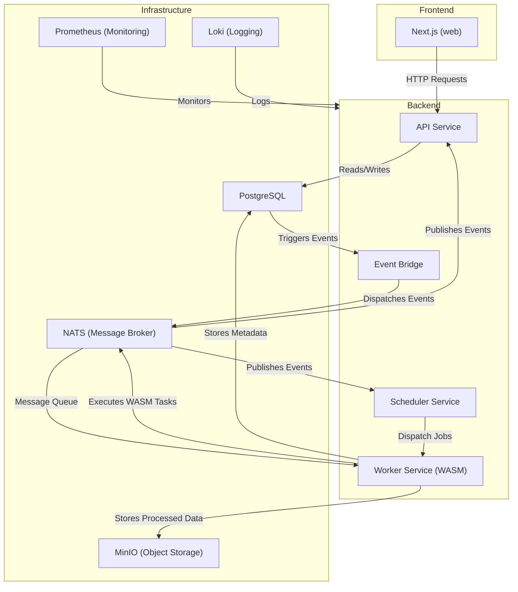

# Shallabuf

## Architecture

Shallabuf follows a modular, service-oriented architecture where independent services communicate through a combination of **PostgreSQL events** and **NATS messaging**. The system is designed for scalability, leveraging **WebAssembly (WASM)** for secure and efficient execution of tasks.

### Backend Services

The backend is built in Rust and consists of several key services:

- **API Service (`api/`)**: Handles client requests and exposes RESTful endpoints.
- **Worker Service (`worker/`)**:
  - Accepts messages from the scheduler.
  - Executes tasks inside **WebAssembly (WASM)** modules using the **Wasmtime runtime**.
  - Uses **WASI (WebAssembly System Interface)** for secure interaction with the host environment.
  - Provides a lightweight, sandboxed execution environment for isolated tasks.
- **Scheduler Service (`scheduler/`)**:
  - Manages scheduled jobs and dispatches tasks to worker services.
  - Ensures efficient task distribution based on workload.
- **Event Bridge (`event-bridge/`)**:
  - Listens to **PostgreSQL events** (e.g., inserts, updates, deletes).
  - Dispatches these events to other services using **NATS**, a high-performance messaging system.
  - Enables real-time event-driven communication between system components.

### Database & Storage

- **PostgreSQL (`db/`)**: The primary relational database for structured application data.
- **MinIO**: Provides object storage for large files and unstructured data. (S3 compatible)

### Infrastructure

- **Docker & Docker Compose**: Used for containerization and service orchestration.
- **SQLx (`.sqlx/`)**: A Rust-based database toolkit for schema management and queries.
- **NATS**: A lightweight, high-performance messaging system for service communication.
- **Loki (`loki-config.yaml`)** & **Prometheus (`prometheus.yaml`)**: Used for logging, monitoring, and observability.

### Frontend

- **Next.js (`web/`)**: A React-based frontend framework for the user interface.
- **Bun**: A fast JavaScript runtime used for dependency management and development tooling.

By utilizing **PostgreSQL events and NATS**, Shallabuf achieves a highly efficient **event-driven architecture**, ensuring **real-time updates, decoupled communication, and scalable task execution**.



### Explanation

- **Frontend**: The Next.js app interacts with the backend via API calls.
- **API Service**: Communicates with the database and publishes events when changes occur.
- **Event Bridge**: Listens for PostgreSQL events and publishes them via NATS.
- **Scheduler**: Dispatches jobs to worker services via NATS.
- **Worker Service**: Executes WebAssembly (WASM) modules securely using Wasmtime.
- **Infrastructure**: Includes PostgreSQL (for data), MinIO (for object storage), NATS (for messaging), and monitoring/logging tools like Loki and Prometheus.

This provides a **clear, structured view** of your architecture in **Mermaid format**. Let me know if you want any modifications! 🚀

## Development

### Prerequisites

Required tools:

- Rust ^1.84
- Bun ^1.1
- Docker ^27.4
- just (command runner)
- MinIO Client (mc)
- PostgreSQL Client (psql)

Optional but recommended:

- asdf (for managing Bun version)
- cargo-make (for running Rust services)
- cargo-watch (for development)
- cargo-sqlx (for database migrations)

### Installation

1. **Install Just**

   Follow the [official Just installation guide](https://github.com/casey/just?tab=readme-ov-file#installation)

2. **Install Required Tools**

   ```sh
   # Install all required tools (includes cargo-make and MinIO Client)
   just install-tools

   # Install Bun using asdf (optional)
   just install-bun
   ```

### Setup

#### TL;DR

```sh
just install-tools   # Install all required tools
just create-env      # Create .env from template
just dev             # Start all services
```

For detailed setup, follow these steps:

1. **Environment Setup**

   ```sh
   # Create .env file from example
   just create-env
   ```

2. **Start Infrastructure**

   ```sh
   # Start all Docker containers (PostgreSQL, MinIO, NATS, etc.)
   just docker-up
   ```

3. **Database and MinIO Setup**

   ```sh
   # Sets up MinIO credentials, creates database, runs migrations and seeds
   just setup-db
   ```

4. **Frontend Setup**

   ```sh
   # Install frontend dependencies
   just setup-frontend
   ```

### Development Workflow

1. **Start All Services**

   ```sh
   # Starts both frontend and backend services
   just dev
   ```

   Or start them separately:

   ```sh
   # Start frontend only
   just dev-frontend

   # Start backend services only
   just dev-backend
   ```

2. **Backend Services Order**
   Services start in the following order:
   1. Event Bridge
   2. Worker
   3. Scheduler
   4. API

3. **Access Services**
   - Frontend: [http://localhost:3000](http://localhost:3000)
   - MinIO Console: [http://localhost:30901](http://localhost:30901) (default credentials: minio/minioadmin)
   - API: [http://localhost:8000](http://localhost:8000)
   - Grafana: [http://localhost:30001](http://localhost:30001) (default credentials: admin/admin)
   - Prometheus: [http://localhost:30090](http://localhost:30090)

### Test Users

Pre-configured test users:

- Email: <alex@mail.com>, Password: alexpass
- Email: <bob@mail.com>, Password: bobpass

### Useful Commands

```sh
# Clean up everything (stop docker, clean database, etc.)
just clean

# Reset database (drops, recreates, migrates, and seeds)
just reset-db

# Run all tests
just test

# Format code
just fmt

# Lint code
just lint
```

### Troubleshooting

1. **MinIO Access Issues**
   - Ensure MinIO is running: `docker ps | grep minio`
   - Check credentials in .env file
   - Try rerunning setup: `just setup-minio`

2. **Database Connection Issues**
   - Ensure PostgreSQL is running: `docker ps | grep postgres`
   - Check DATABASE_URL in .env file
   - Try waiting for database: `just wait-for-db`

3. **Service Start Issues**
   - Ensure all containers are running: `docker ps`
   - Check logs: `docker compose logs`
   - Try restarting services: `just docker-down && just docker-up`

### Project Structure

```txt
.
├── api/            # API service
├── builtins/       # WASM modules
├── db/             # Database migrations and seed data
├── event-bridge/   # Event bridge service
├── scheduler/      # Scheduler service
├── web/           # Frontend (Next.js)
├── worker/        # Worker service
├── .env.example   # Environment template
├── docker-compose.yaml
├── justfile       # Command runner recipes
└── Makefile.toml  # Cargo make tasks
```
